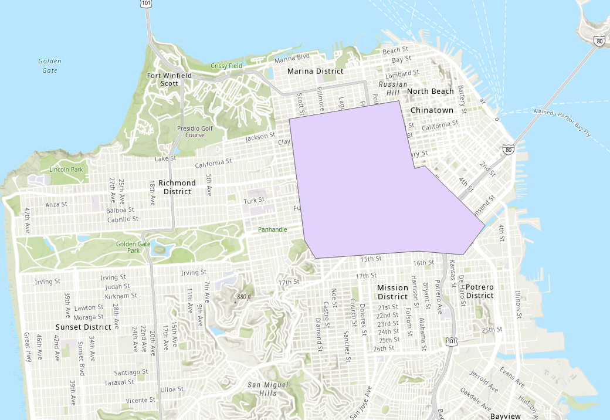
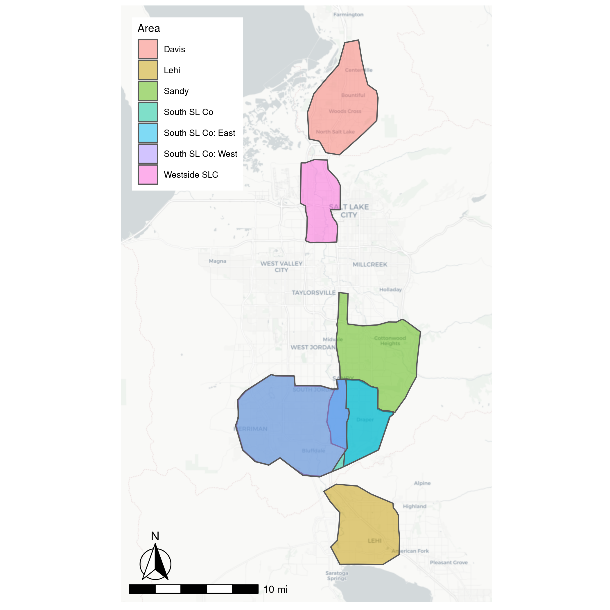

# Methodology

## Overview
This chapter describes the methodology we followed to generate the simulation scenarios. First, we will provide background information on BEAM itself, including the modifications to use geofencing for microtransit vehicles. This is followed by descriptions of the BEAM scenarios we developed for this research.


## BEAM
BEAM is a transportation simulation model with a focus on adaptive planning for individual agents. This is very similar to MATSim; in fact, BEAM is itself an extension to MATSim, but differs in an emphasis on within-day planning, rather than MATSim's across-day planning. This allows agents to dynamically respond to the current simulation state, for example to make a decision based on current modeled travel times [@beamdocs].

BEAM typically will run several iterations of the simulation, so that the results of one iteration (congestion, travel times, etc.) are taken into account at the beginning of the next iteration. In this way, the across-day planning typical of MATSim is still performed.

BEAM has native support for a wide variety of transportation modes, including driving, walking, biking, and transit. There is also a "ridehail" mode (in BEAM this is referred to as "transportation network companies (TNCs)"), which would include taxis and similar modes with non-fixed routes. These modes are able to respond to specific pickup and dropoff requests, and can be configured as a "pooled" option, where multiple passengers with different travel paths can share a vehicle.

In this project, we are representing on-demand transit (ODT) in BEAM as a pooled ridehail option. Agents request a pooled ridehail trip, and a ridehail vehicle services the request. BEAM contains internal algorithms to match ridehail requests with vehicles, and to intelligently pool multiple requests when feasible.

### Geofencing Modifications
One part of many ODT implementations---including the implementation in Salt Lake County---is a zone within which ODT vehicles must stay. BEAM natively offers some support for this “geofencing” of ODT vehicles, but this is limited as an operating radius.

We were able to adapt BEAM's implementation to allow a geofence in the form of an arbitrary polygon. BEAM will check that a request for ODT originates and ends within the specified geofence, and only accept those requests that do. We were also able to allow for multiple geofence polygons, with a fleet specific to each one.

As an example, Figures \@ref(fig:sanfran-polygon) and \@ref(fig:via-visualization) show an implementation we tested with a San Francisco network, one of the default scenarios in BEAM [@beamdocs]. Figure \@ref(fig:sanfran-polygon) shows the polygon we used (chosen arbitrarily), and Figure \@ref(fig:via-visualization) highlights that the ODT vehicles are only traveling within the geofence. This visualization was done with Simunto's VIA software [@SimuntoVIA].

```{r sanfran-polygon}
#| fig.cap="San Fransisco with example geofencing polygon."


```

```{r via-visualization}
#| fig.cap="Simulated vehicles in BEAM San Francisco scenario. Left: all vehicles (sample population). Right: ODT vehicles, restricted to user-specified operating area.",
#| fig.show="hold",
#| out.width="50%"

knitr::include_graphics(c(
  "image/all_vehicles_in_san_fransisco.png",
  "image/odt_in_san_fransisco.png"))

```


## Scenario Description
The BEAM documentation [@beamdocs] lists the inputs required to run a BEAM scenario. Our implementation of BEAM largely follows these requirements, though there are a few differences. The following is a list of the requirements for our implementation:

- A configuration file
- A population file
- A households file and a corresponding attributes file
- A plans file
- A network
- The definition of vehicle types
- The personal vehicle fleet
- The microtransit/ODT fleet
- Transit data in the form of GTFS archives

These requirements are explained in greater detail in the following sections. For a full specification of the inputs, see the README at [https://github.com/byu-transpolab/microtransit_areas2/README.md]. Much of the work in creating these inputs was done by @MacfarlaneLant previously, though we have made modifications to better fit our analysis.

### Configuration File
The configuration file lists nearly all of the parameters used in the scenario, including aspects such as the number of iterations to run and paths to the other relevant files. This is one of the few input files that differs between the various scenarios we ran, as inputs such as the population and network remained constant. The configuration file is the main file that BEAM uses to set up and run the given scenario.

### Population and Household Files
The population, households, and household attributes files are all part of a synthetic population created using PopulationSim. @MacfarlaneLant generated this synthetic population in order to represent the WFRC/MAG region in 2019. We are using the same population in our analysis.

The population file consists of an identifier for each member of the population along with attributes such as age, income, and value of time. This file also contains the ID of the household to which each person belongs. The households and household attributes files contain information for each household in the population, including location, size, and auto ownership.

### Plans File
We supplied the aforementioned synthetic population to the ActivitySim activity-based travel model platform, which created an initial travel demand in the form of a plans file. We set ActivitySim to model the demand for a single weekday. This plans file lists each person that made a trip during that day, as well as their corresponding plans, including information on the time, location, and nature of the attended activities, as well as the mode of transportation used for each leg of the trip.

#### Network skims
In order to model destination choice and activity choice, ActivitySim requires network skims. We used the same skims as @MacfarlaneLant, which are modified from the skims in the existing WFRC trip-based model. These skims are not used directly in BEAM, however. A separate network file is required.

### Network
Originally, we planned and attempted to use the network provided by @UGRCnetwork to create an "all-streets" network. However, we ran into several issues with this approach. One issue in particular was that of connectivity: in the provided network file, several roadways did not connect where they should and many highway overpasses were erroneously connected to the roads underneath, among other problems. Because of this, we instead used the network in the Wasatch Front Regional Council's travel demand model [@WFRCnetwork].

### Vehicle Fleets and Types
Several files relate to the various vehicle fleets in the scenario. Central to these is a definition file containing the name and attributes of each vehicle type. We specified a personal vehicle fleet according to the auto ownership information given in the households file, and a microtransit/ODT fleet based on each of the scenarios we included. Section \@ref(scenario-configuration) contains more information on the specific fleets we used.

Another aspect of this is assigning routes and schedules to transit vehicles. BEAM uses GTFS data for this. In our case, we used the GTFS archives provided by UTA, valid for March--April 2022. In our configuration we chose a specific date of March 30, 2022, which is a Wednesday.


## Scenarios {#scenario-configuration}
We first needed to assess the performance of BEAM relative to real-world data. As UTA already has a microtransit ODT pilot program underway, we reached out to find the fleet size and shifts for the microtransit vehicles. Shaina Quinn, a researcher at UTA's Office of Innovative Mobility Solutions, informed us that typically 12 vehicles provide service at a time. We found the shifts on UTA's website for the service [@SLCSouth].

UTA reported several metrics, which are presented in Table \@ref(tab:uta-metrics). Much of the data in that report, however, is not necessarily representative, due to the COVID-19 pandemic and its onset in late March 2020. We also considered that the data for December was not necessarily valuable: since the service was new, people who would otherwise have used it may not have been accustomed to or even known about it. We therefore decided to use the average of the data from January through March as our benchmark.

```{r uta-metrics}
tar_read(UTA_table) %>% 
  kbl(booktabs = TRUE, digits = c(0,0,2,1),
      caption = "Metrics Reported by UTA for the ODT Pilot Program in Salt Lake County") %>% 
  row_spec(row = 13:14, bold = TRUE) %>% 
  kable_styling()
```

We created a scenario in BEAM to model this pilot program, and compared the results with the metrics reported by UTA. Our initial comparison showed that BEAM significantly over-predicted microtransit ridership and under-predicted wait times relative to the reported data. After calibrating several of BEAM's internal coefficients, the results more closely matched the observed data, and so we retained those calibrated values for all of the scenarios we ran. More information on the calibration process is given in Section \@ref(scenario-calibration).

In addition to modeling the existing pilot program, we created other scenarios to analyze. A map showing the areas we analyzed is given in Figure \@ref(fig:zone-map). For each of these areas we defined a microtransit fleet, including fleet size and operating hours, which can be seen in Table \@ref(tab:zone-fleets). The size of the fleet for each area was determined from population and employment, based on the actual fleet sizes for the South SL Co and Westside SLC areas. The operating hours were likewise copied from the existing service hours. We were less concerned with modeling each of these areas individually, but rather how the addition of another area would affect the whole. We therefore created several scenarios as combinations of these areas, which are given in Table \@ref(tab:scenarios-info).

Since the beginning of this project, UTA has started full-time microtransit service in the original pilot program area, as well as in the "Westside SLC" area. As such, we included both of these areas in our "Existing" scenario as well as most of the others. We also analyzed a "Split" scenario, in which the original south Salt Lake county area is divided into an east and west area.

```{r zone-map}
#| fig.cap="Map of areas studied."

```

```{r zone-fleets}
tar_read(zone_info) %>% 
  kbl(booktabs = TRUE, digits = c(0,0,2,2),
      caption = "Information on Fleets Used in Each Area") %>% 
  kable_styling()
```

```{r scenarios-info}
tar_read(scenario_key) %>% 
  kbl(booktabs = TRUE,
      caption = "Areas Corresponding to Each Scenario") %>% 
  kable_styling()
```

### Common configuration
All of the scenarios we ran had a nearly identical configuration. The main exception to this was the ODT fleet used. There are many configurable options in BEAM (the full configuration is available at [https://github.com/byu-transpolab/beam_scenarios]), but there are two worth mentioning here: sample size and number of iterations.

Due to the computational power and time required to run BEAM, we were unable to run a full sample for any of our scenarios. We ultimately needed to decide on a balance between sample size and the number of iterations to run, as increasing one necessitated decreasing the other. We decided that 10 iterations was reasonable, as the smaller test scenarios seemed to mostly converge at that point. With 10 iterations, we were able to run a 20% population sample for each of our scenarios. This sampling was done entirely in BEAM; BEAM offers support for this natively. BEAM also offers scaling factors for network capacity, which we set to match our population sample size.

However, we were not sure of the best, if any, way to scale the ODT fleets. We didn't simply scale the fleets to the same degree as the population, as that would create fleets containing a fractional number of vehicles. There was also a concern for availability: due to the small size of the fleets, there is no guarantee that there will be a vehicle available for any given ODT request. As such, it is not clear what the relationship between fleet size and ridership is, but it is not assumed to be a linear one.


## Calibration {#scenario-calibration}
Ideally, the results of our model would match observed data when studying the same scenario. In our case, we used the mode shares as our metric. Our initial results significantly over-predicted ridehail usage, so we first looked to calibrate ActivitySim. BEAM takes the results of an ActivitySim model as an input, and so by adjusting ActivitySim to better reflect reality, calibrating BEAM became easier.

ActivitySim has several coefficients that can be changed to affect both tour and trip mode choice. We calibrated ActivitySim to about 1% ridehail in the overall tour mode split. We then focused on calibrating the trip mode choice coefficients, but found that there was virtually no effect on overall mode split. Ultimately we were aiming for a 0.2% ridehail mode share, which is less than what we were able to produce.

We then generated plans from ActivitySim again as our new input plans to BEAM. From there, we modified BEAM's coefficients in an attempt to again match our mode split target of 0.2%, using a 15% population sample. We were able to shift the mode split from its original values, but the results were similar to that of the ActivitySim calibration.

This sub-optimal calibration is a limitation of this study; however, we are generally more concerned with the relative performance between the scenarios we are studying rather than the absolute performance. This is discussed in more detail in Sections \@ref(results) and \@ref(recommendations).
